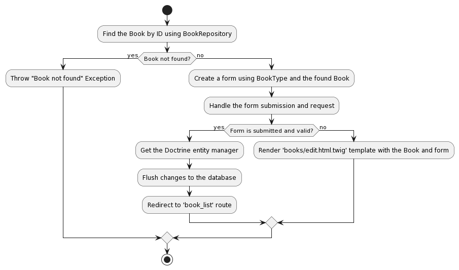
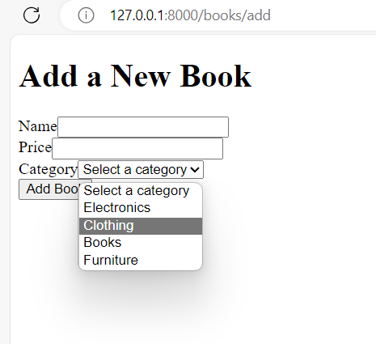
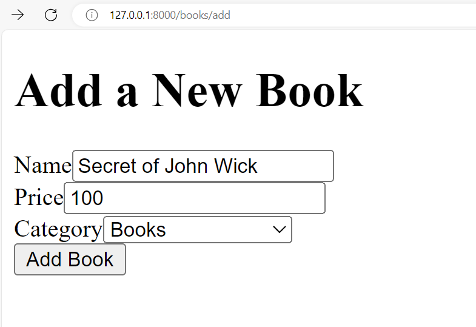

# Lecture 04: Models and Views

Now, we are going to learn Models and Views by building a BookStore application.

The application can help to:

- Create a new book
- Get all books
- Update the book by id
- Delete the book by id

Below is the table design of the Books table


Small recap about MVC model



## Models

Now, we are going to create the `Book` Model (or Entity) by using the command line and follow the steps below

```bash
php bin/console make:entity
```


Voila, you can see the `Book.php` entity is created with the `BookRepository.php`


## Connect to Database

After we created the Model (Entity), we will connect to the database.

First of all, make sure you enable XAMPP


Then, you can navigate to the URL `http://localhost/phpmyadmin/` to see the `phpMyAdmin` to manage the database


Next, we need to config the `DATABASE_URL` in the `.env` file

```bash
# .env
DATABASE_URL=mysql://root:@127.0.0.1:3306/book_store?serverVersion=mariadb-10.4.11
```

Then, we can use command line to create the database

```bash
php bin/console doctrine:database:create
```


In the `phpMyAdmin`, you can see the database `book_store` is created.


## Create the table with migration

Now, the database is created. We need to create the table from the Model.

To do so, we need to create a migration first.

```bash
php bin/console make:migration
```


You can see the folder `migrations` is created with the migration file inside it.


Now, use the command below to start create the table

```bash
php bin/console doctrine:migrations:migrate
```



Now, the table `book` is created in the `phpMyAdmin`.



## Create the `BookController`

Now, it's time to create the controller. Here the command to create it.

```bash
php bin/console make:controller BooksController
```

Then, open the `BooksController.php` to modify the source. The source code will help to get all books in the database

```php
// /src/Controller/BooksController.php
class BooksController extends AbstractController
{
    /**
     * @Route("/books", name="book_list")
     */
    public function index(BookRepository $bookRepository): Response
    {
        $books = $bookRepository->findAll();

        return $this->render('books/index.html.twig', [
            'books' => $books,
        ]);
    }
}
```

Now, modify the view to display all the books from database.

To do that, modify the file `/src/templates/books/index.html.twig`

```twig



    <h1>Book List</h1>

    <table>
        <tr>
            <th>ID</th>
            <th>Name</th>
            <th>Price</th>
        </tr>
        
            <tr>
                <td>{{ book.id }}</td>
                <td>{{ book.name }}</td>
                <td>{{ book.price }}</td>
            </tr>
        
    </table>

```

Now, start the project to see the result

```bash
symfony serve
```

You can navigate to the URL `http://127.0.0.1:8000/books` to see all the books.

At first, it is empty because there is nothing in the table. You need to insert some data into the table.

Use the SQL script below to insert data into the table in `phpMyAdmin`

```sql
USE book_store;

-- Insert dummy data into the book table
INSERT INTO book (name, price) VALUES
    ('Book 1', 20),
    ('Book 2', 30),
    ('Book 3', 25),
    ('Book 4', 15),
    ('Book 5', 40);
```


Now, refresh the website to see all books


## Create a new book with Form Builder

Now, we will create a new book.

To do that, we need to create a form. In Symfony, we will use form builder.

Open your terminal and run the following command to generate a form type:

```bash
php bin/console make:form BookType
```


Follow the prompts and generate the form type. This will create a file named `BookType.php` in the `src/Form` directory.

### Create the action in the Controller for adding new book

In the `BookController.php`, add a new action named `addBook()`:

```php
use App\Form\BookType;
use Symfony\Component\HttpFoundation\Request;

// ...

/**
 * @Route("/books/add", name="add_book")
 */
public function addBook(Request $request): Response
{
    $newBook = new Book();

    $form = $this->createForm(BookType::class, $newBook);
    $form->handleRequest($request);

    if ($form->isSubmitted() && $form->isValid()) {
        $entityManager = $this->getDoctrine()->getManager();
        $entityManager->persist($newBook);
        $entityManager->flush();

        return $this->redirectToRoute('book_list');
    }

    return $this->render('book/add.html.twig', [
        'form' => $form->createView(),
    ]);
}
```

### Create the View for Adding a New Book

Create a new Twig template named `add.html.twig` inside the `templates/books` directory:

```twig



    <h1>Add a New Book</h1>
    {{ form_start(form) }}
    {{ form_row(form.name) }}
    {{ form_row(form.price) }}
    <button type="submit">Add Book</button>
    {{ form_end(form) }}

```

Now, navigate to `http://127.0.0.1:8000/books/add` to see the form.


