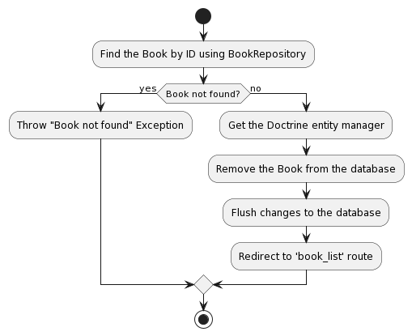

# Lecture 05: Repository

Now, we will use the Repository. Take a look at the architecture overview


With the repository, we can write custom query to perform variety of CRUD operations.

For example, we will create a search bar to search for books with price ranges.

Let's start by creating a function in the repository to find books with a price greater than the input price.

Then, we'll add a search bar to the `index.html.twig` view and create a controller to handle the search query using the `findBooksWithPriceGreaterThan()` function.

## Create the Function in the Repository

Open the `BookRepository.php` file located in the `src/Repository` directory.

Add the following function to the repository to find books with a price greater than the input price:

```php
use Doctrine\Bundle\DoctrineBundle\Repository\ServiceEntityRepository;
use Doctrine\Persistence\ManagerRegistry;

class BookRepository extends ServiceEntityRepository
{
    // ...

    public function findBooksWithPriceGreaterThan($price): array
    {
        return $this->createQueryBuilder('b')
            ->andWhere('b.price > :price')
            ->setParameter('price', $price)
            ->getQuery()
            ->getResult();
    }
}
```

## Create a New Controller for Handling the Search Query

Create a new controller file named `SearchController.php` in the `src/Controller` directory.

Add the following code to the `SearchController.php` file:

```php
use App\Repository\BookRepository;
use Symfony\Component\HttpFoundation\Request;
use Symfony\Component\Routing\Annotation\Route;

class SearchController extends AbstractController
{
    /**
     * @Route("/search/books", name="search_books")
     */
    public function searchBooks(Request $request, BookRepository $bookRepository): Response
    {
        $price = $request->query->get('price', 0);

        $books = $bookRepository->findBooksWithPriceGreaterThan($price);

        return $this->render('books/index.html.twig', [
            'books' => $books,
        ]);
    }
}

```

## Add a Search Bar to the `index.html.twig` View

Open the `templates/books/index.html.twig` file and add a search bar above the book list table:

```twig



    <h1>Book List</h1>

    <form action="{{ path('search_books') }}" method="get">
        <label for="price">Search books with price greater than:</label>
        <input type="number" name="price" id="price" required>
        <button type="submit">Search</button>
    </form>

    <table>
        <tr>
            <th>ID</th>
            <th>Name</th>
            <th>Price</th>
            <th>Actions</th>
        </tr>
        
            <tr>
                <td>{{ book.id }}</td>
                <td>{{ book.name }}</td>
                <td>{{ book.price }}</td>
                <td>
                    <a href="{{ path('view_book', {'id': book.id}) }}">View Details</a>
                    <a href="{{ path('edit_book', {'id': book.id}) }}">Edit</a>
                    <a href="{{ path('delete_book', {'id': book.id}) }}" onclick="return confirm('Are you sure you want to delete this book?')">Delete</a>
                </td>
            </tr>
        
    </table>

```

Now, you can see the search bar


Now, use the search bar to search for books with price greater than 15.


## Adding Category model.

Now, we will expend the application. We will create the Category model with the following design.



As you can see, `one` Category will belong to `many` books. So that's `one-to-many` relationship.

Now, we need to generate the Category entity with command line

```bash
php bin/console make:entity
```


Now, we need to perform the migration and update the database with following command line

```bash
php bin/console make:migration
php bin/console doctrine:migrations:migrate
```


Now, open the `phpMyAdmin`, we can see the new `Category` table and the new design


