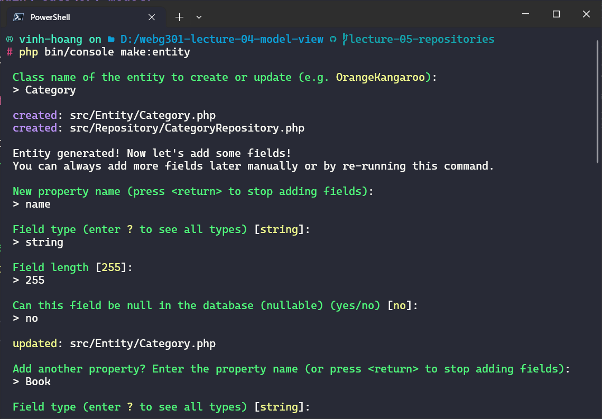
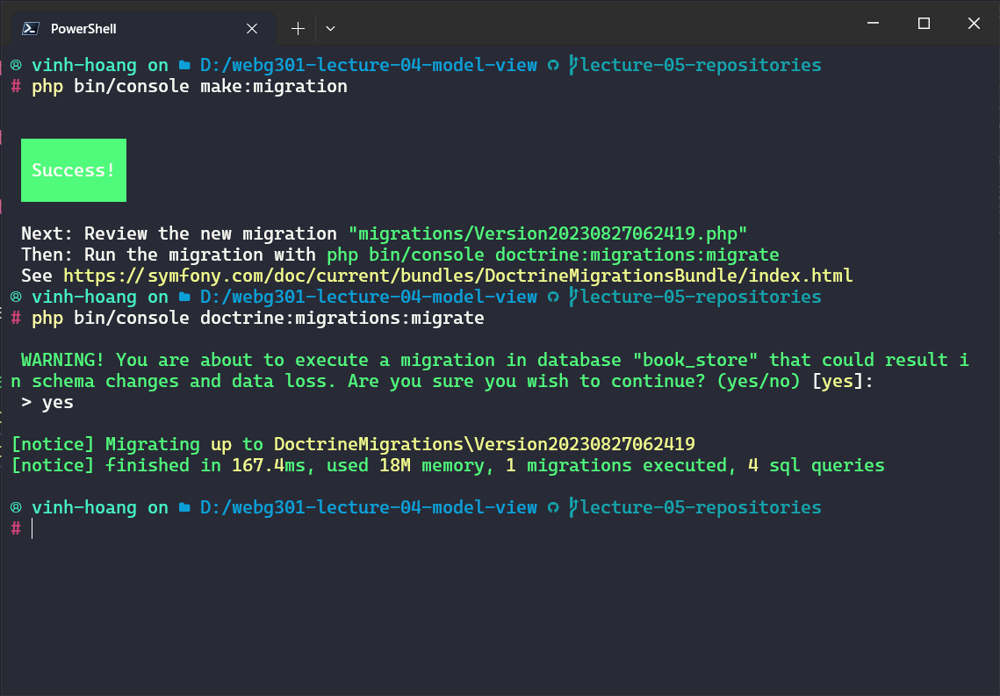
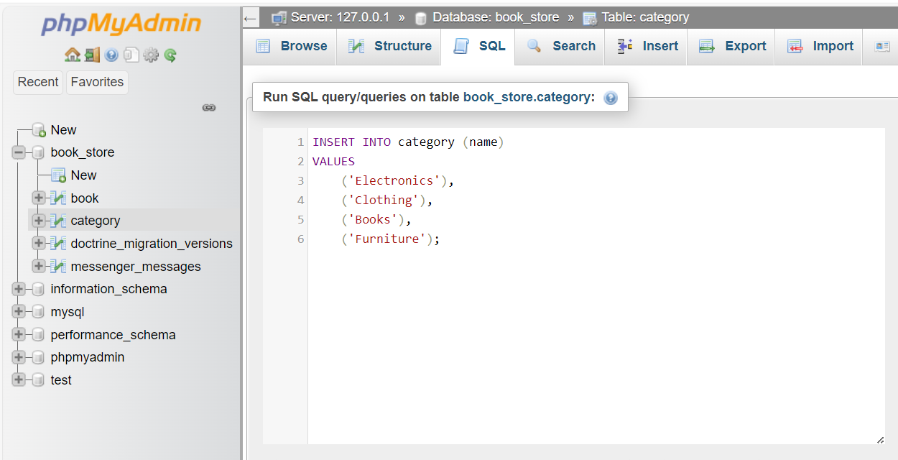

# Lecture 05: Repository

Now, we will use the Repository. Take a look at the architecture overview


With the repository, we can write custom query to perform variety of CRUD operations.

For example, we will create a search bar to search for books with price ranges.

Let's start by creating a function in the repository to find books with a price greater than the input price.

Then, we'll add a search bar to the `index.html.twig` view and create a controller to handle the search query using the `findBooksWithPriceGreaterThan()` function.

## Create the Function in the Repository

Open the `BookRepository.php` file located in the `src/Repository` directory.

Add the following function to the repository to find books with a price greater than the input price:

```php
use Doctrine\Bundle\DoctrineBundle\Repository\ServiceEntityRepository;
use Doctrine\Persistence\ManagerRegistry;

class BookRepository extends ServiceEntityRepository
{
    // ...

    public function findBooksWithPriceGreaterThan($price): array
    {
        return $this->createQueryBuilder('b')
            ->andWhere('b.price > :price')
            ->setParameter('price', $price)
            ->getQuery()
            ->getResult();
    }
}
```

## Create a New Controller for Handling the Search Query

Create a new controller file named `SearchController.php` in the `src/Controller` directory.

Add the following code to the `SearchController.php` file:

```php
use App\Repository\BookRepository;
use Symfony\Component\HttpFoundation\Request;
use Symfony\Component\Routing\Annotation\Route;

class SearchController extends AbstractController
{
    /**
     * @Route("/search/books", name="search_books")
     */
    public function searchBooks(Request $request, BookRepository $bookRepository): Response
    {
        $price = $request->query->get('price', 0);

        $books = $bookRepository->findBooksWithPriceGreaterThan($price);

        return $this->render('books/index.html.twig', [
            'books' => $books,
        ]);
    }
}

```

## Add a Search Bar to the `index.html.twig` View

Open the `templates/books/index.html.twig` file and add a search bar above the book list table:

```twig



    <h1>Book List</h1>

    <form action="{{ path('search_books') }}" method="get">
        <label for="price">Search books with price greater than:</label>
        <input type="number" name="price" id="price" required>
        <button type="submit">Search</button>
    </form>

    <table>
        <tr>
            <th>ID</th>
            <th>Name</th>
            <th>Price</th>
            <th>Actions</th>
        </tr>
        
            <tr>
                <td>{{ book.id }}</td>
                <td>{{ book.name }}</td>
                <td>{{ book.price }}</td>
                <td>
                    <a href="{{ path('view_book', {'id': book.id}) }}">View Details</a>
                    <a href="{{ path('edit_book', {'id': book.id}) }}">Edit</a>
                    <a href="{{ path('delete_book', {'id': book.id}) }}" onclick="return confirm('Are you sure you want to delete this book?')">Delete</a>
                </td>
            </tr>
        
    </table>

```

Now, you can see the search bar


Now, use the search bar to search for books with price greater than 15.


## Adding Category model.

Now, we will expend the application. We will create the Category model with the following design.


As you can see, `one` Category will belong to `many` books. So that's `one-to-many` relationship.

Now, we need to generate the Category entity with command line

```bash
php bin/console make:entity
```




Now, we need to perform the migration and update the database with following command line

```bash
php bin/console make:migration
php bin/console doctrine:migrations:migrate
```



Now, open the `phpMyAdmin`, we can see the new `Category` table and the new design


## Create SQL query to insert samples Category to the database

To insert sample Category data into your database using SQL, you can execute an SQL query like this:

```sql
INSERT INTO category (name)
VALUES
    ('Electronics'),
    ('Clothing'),
    ('Books'),
    ('Furniture');
```



## Modify the FormBuilder to include the Category

Open the `src/Form/BookType.php` file.

You'll need to add a field for selecting the Category. Assuming you have a relation between Book and Category called category, you can use the `EntityType` field type for this purpose.

```php
use App\Entity\Category; // Import the Category entity
use Symfony\Bridge\Doctrine\Form\Type\EntityType;
// ...

class BookType extends AbstractType
{
    public function buildForm(FormBuilderInterface $builder, array $options)
    {
        $builder
            ->add('name')
            ->add('price')
            ->add('category', EntityType::class, [
                'class' => Category::class,
                'choice_label' => 'name', // Display category names in the dropdown
                'placeholder' => 'Select a category', // Optional: Add a placeholder
            ]);
    }
}
```

Open the form template for Book (located at `templates/book/add.html.twig`) and add the category field to the form.

```twig



    <h1>Add a New Book</h1>
    {{ form_start(form) }}
    {{ form_row(form.name) }}
    {{ form_row(form.price) }}
    {{ form_row(form.category) }} {# Add this line to display the category dropdown #}
    <button type="submit">Add Book</button>
    {{ form_end(form) }}

```

Now, navigate to `http://127.0.0.1:8000/books/add`, you can see the Category field


## Update the BooksController and the index view to display all books with the category name

Open the `BooksController.php` file.

In the `index` action, fetch books with their associated categories using a custom query. You'll need to join the Category entity to the Book entity.

```php
/**
 * @Route("/books", name="book_list")
 */
public function index(BookRepository $bookRepository): Response
{
    $books = $bookRepository->findAllWithCategory(); // <- change this line

    return $this->render('books/index.html.twig', [
        'books' => $books,
    ]);
}
```

Create a custom repository function in your `BookRepository` to fetch books with their associated categories.

```php
class BookRepository extends ServiceEntityRepository
{
    // ...

    public function findAllWithCategory()
    {
        return $this->createQueryBuilder('b')
            ->leftJoin('b.category', 'c')
            ->addSelect('c')
            ->getQuery()
            ->getResult();
    }
}
```

Open the `templates/book/index.html.twig` file.

Modify the table header to include a "Category" column:

```twig
<tr>
    <th>ID</th>
    <th>Name</th>
    <th>Price</th>
    <th>Category</th> <!-- Add this line -->
    <th>Actions</th>
</tr>
```

Update the table rows to display the category name for each book:

```twig

    <tr>
        <td>{{ book.id }}</td>
        <td>{{ book.name }}</td>
        <td>{{ book.price }}</td>
        <td>{{ book.category.name }}</td> <!-- Display the category name -->
        <td>
            <a href="{{ path('view_book', {'id': book.id}) }}">View Details</a>
            <a href="{{ path('edit_book', {'id': book.id}) }}">Edit</a>
            <a href="{{ path('delete_book', {'id': book.id}) }}" onclick="return confirm('Are you sure you want to delete this book?')">Delete</a>
        </td>
    </tr>

```

Now, add the new book


You can see books displayed with the category name.


## Add a button to the index view to navigate to add view

Open the `templates/books/index.html.twig` file.

Add a new button or link at the top of the page, above the table of books, to navigate to the "Add Book" view. You can use the path function to generate the URL for the "Add Book" route.

```twig



    <h1>Book List</h1>

    <a href="{{ path('add_book') }}" class="btn btn-primary">Add Book</a> <!-- Add this button -->

    <table>
        <tr>
            <th>ID</th>
            <th>Name</th>
            <th>Price</th>
            <th>Category</th>
            <th>Actions</th>
        </tr>
        
            <tr>
                <td>{{ book.id }}</td>
                <td>{{ book.name }}</td>
                <td>{{ book.price }}</td>
                <td>{{ book.category.name }}</td>
                <td>
                    <a href="{{ path('view_book', {'id': book.id}) }}">View Details</a>
                    <a href="{{ path('edit_book', {'id': book.id}) }}">Edit</a>
                    <a href="{{ path('delete_book', {'id': book.id}) }}" onclick="return confirm('Are you sure you want to delete this book?')">Delete</a>
                </td>
            </tr>
        
    </table>

```

Now, you can see a link for adding a new book


